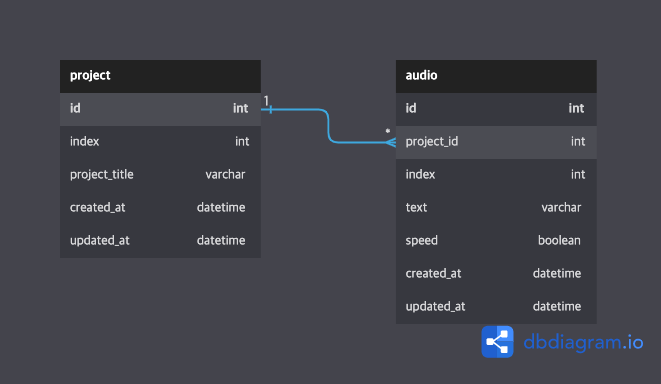

# Text to Speech(TTS)

텍스트를 받아 해당 텍스트를 읽어주는 오디오 파일을 생성하는 기능 구현

## Installation

requirements.txt 파일을 이용하여 필요한 패키지를 설치합니다.

```bash
pip install -r requirements.txt
```

## Database



## Feature

- [x] 프로젝트 생성(해당 프로젝트 오디오 생성)  
- [x] 텍스트 조회  
- [x] 텍스트(오디오 파일) 수정  
- [ ] 오디오 파일 송신  
- [x] 텍스트(오디오 파일) 생성/삭제  
- [x] 프로젝트 삭제(해당 프로젝트 오디오 삭제)

## API


| Method |      URL      |  Description  |
| :----: | :-----------: | :-----------: |
|  POST  | /api/project/ | 프로젝트 생성 |
| DELETE | /api/project/ | 프로젝트 삭제 |

| Method |                   URL                   |       Description        |
| :----: | :-------------------------------------: | :----------------------: |
|  POST  |      /api/audio/{int:project_id}/       | 텍스트(오디오 파일) 생성 |
|  GET   | /api/audio?project_id={int}&page={int}  |       텍스트 조회        |
|  PUT   | /api/audio/{int:project_id}/{int:index} | 텍스트(오디오 파일) 수정 |
| DELETE | /api/audio/{int:project_id}/{int:index} | 텍스트(오디오 파일) 삭제 |

* 프로젝트 생성

    + Body
    ```
    {
        "index": index,
        "title": "title",
        "text": ["text"]
    }
    ```
    + Response
    ```
    {
        "status": 201
    }
    ```

* 프로젝트 삭제

    + Body
    ```
    {
        "project_id": project_id
    }
    ```
    + Response
    ```
    {
        "status": 200
    }
    ```

* 텍스트(오디오 파일) 생성

    + Body
    ```
    {
        "text": "text",
        "speed": false,
        "index": index
    }
    ```
    + Response
    ```
    {
        "status": 201
    }
    ```

* 텍스트 조회

    + Response
    ```
    {
        "res": [
            {
                "id": id,
                "created_at": "2022-11-17T20:48:31.138507",
                "updated_at": "2022-11-17T20:48:31.138587",
                "index": 0,
                "text": "text",
                "speed": false,
                "project": project_id
            },
            {
                "id": id,
                "created_at": "2022-11-17T20:48:31.138902",
                "updated_at": "2022-11-17T20:48:31.138948",
                "index": 1,
                "text": "text",
                "speed": false,
                "project": project_id
            },
            {
                "id": id,
                "created_at": "2022-11-17T20:48:31.139096",
                "updated_at": "2022-11-17T20:48:31.139139",
                "index": 2,
                "text": "text",
                "speed": false,
                "project": project_id
            }
        ],
        "status": 200
    }
    ```

* 텍스트(오디오 파일) 수정

    + Body
    ```
    {
        "text": "text(수정)",
        "speed": false
    }
    ```
    + Response
    ```
    {
        "status": 200
    }
    ```

* 텍스트(오디오 파일) 삭제

    + Response
    ```
    {
        "status": 200
    }
    ```
